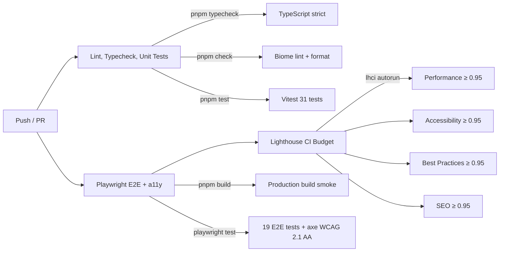

<div align="center">

# 🌐 Juan Silva — Portfolio v2

### Mechatronics Engineer & AI Specialist

*A modern, bilingual portfolio built from scratch with performance, accessibility, and interactive design at its core.*

[](https://nextjs.org/)
[](https://react.dev/)
[](https://www.typescriptlang.org/)
[](https://tailwindcss.com/)
[](https://biomejs.dev/)
[](https://portfolio-juan-silva-eight.vercel.app)
[](LICENSE)

**[Live Site](https://portfolio-juan-silva-eight.vercel.app) · [Architecture](#-architecture) · [Features](#-features-in-detail) · [Cursor System](#-cursor-interaction-system) · [Getting Started](#-getting-started)**

</div>

---

## 📖 Overview

This is the **complete rewrite** of my personal portfolio — the previous version was built in 2023 with Next.js 13, plain JavaScript, and Tailwind 3. After two years without updates and a significant career evolution (from IT Consultant to AI Specialist), it no longer reflected my technical level or professional identity.

The v2 is a ground-up rebuild with a modern stack, feature-based architecture, bilingual content, interactive cursor effects, and a CI pipeline with automated testing and Lighthouse budgets.

### What Makes It Different

- **Cursor Interaction System** — custom `requestAnimationFrame`-based effects: morphing blob, spotlight glow, per-character text distortion, and proximity-based text reveal
- **Bilingual MDX Content** — 13 projects, blog posts, and conference talks in both Spanish and English, with Zod-validated schemas
- **Editorial Aesthetic** — inspired by Linear, Vercel, Rauno Freiberg, and Emil Kowalski. Large display typography, restrained palette, honest hover states
- **Server Components First** — RSC by default, `'use client'` only where strictly needed (cursor, theme toggle, locale switcher)

---

## 🛠️ The Stack

<table>
<tr><td>

**Framework & Language**
- Next.js 16 (App Router + RSC)
- React 19
- TypeScript 5 (strict mode)

</td><td>

**Styling & Animation**
- Tailwind CSS 4 (Oxide engine)
- Motion v12 (Framer Motion)
- next-themes (dark / light)

</td><td>

**Content & i18n**
- Content Collections + MDX
- Zod schemas (type-safe frontmatter)
- next-intl v4 (`/es`, `/en`)

</td></tr>
<tr><td>

**Testing**
- Vitest + Testing Library
- Playwright + axe-core (a11y)
- Lighthouse CI (budget ≥ 0.95)

</td><td>

**Tooling**
- Biome (lint + format)
- pnpm 10
- GitHub Actions CI

</td><td>

**Deploy**
- Vercel
- Analytics + Speed Insights
- Automatic preview deploys

</td></tr>
</table>

---

## ✨ Features in Detail

### 🌍 Bilingual Content System
- **13 projects** with full case studies (problem → solution → stack decisions → impact)
- **Blog posts** on AI in ITSM, career transitions, and technical architecture
- **Conference talks** from ManageEngine Partner Training events
- All content authored in MDX with Zod-validated frontmatter and automatic reading time
- Locale switching without page reload via next-intl middleware

### 🎨 Editorial Design System
- **Three-font stack:** Fraunces (serif display), Inter (sans body), JetBrains Mono (code)
- **Design tokens** via CSS custom properties — theme-aware, no hardcoded colors
- **Dark / Light mode** with `next-themes`, system preference detection, zero flash on load
- **Responsive layout** — mobile-first, tested across breakpoints

### 🔍 SEO & Accessibility
- **JSON-LD** structured data (`Person` + `ProfilePage` schemas)
- **Dynamic sitemap** and `robots.txt` generation
- **OpenGraph** metadata per page with locale-aware canonical URLs
- **WCAG 2.1 AA** compliance verified via axe-core in E2E tests
- **`prefers-reduced-motion`** respected in all animations

### 📱 Contact Integration
- **Floating WhatsApp button** — always visible, pre-filled message with locale context
- **LinkedIn CTA** — direct connection link
- No contact form — intentional decision to reduce friction and eliminate spam

---

## 🎯 Cursor Interaction System

A custom-built cursor interaction layer that transforms the browsing experience on desktop. All effects run on `requestAnimationFrame` loops with `IntersectionObserver` gating for performance.

```
┌─────────────────────── CURSOR PROVIDER (global) ──────────────────────┐
│                                                                        │
│   mousemove event ──▶ MutableRefObject<{x, y}>                        │
│                              │                                         │
│              ┌───────────────┼───────────────────┐                     │
│              ▼               ▼                   ▼                     │
│       ┌────────────┐  ┌────────────┐  ┌──────────────────┐            │
│       │ CursorBlob │  │ Spotlight  │  │ DistortHeading   │            │
│       │            │  │            │  │                   │            │
│       │ Morphing   │  │ Dual-layer │  │ Per-character     │            │
│       │ SVG blob   │  │ radial     │  │ gravity pull      │            │
│       │ with       │  │ gradient   │  │ based on cursor   │            │
│       │ spring     │  │ glow       │  │ distance           │            │
│       │ physics    │  │            │  │                   │            │
│       └────────────┘  └────────────┘  └──────────────────┘            │
│                                              │                         │
│                                   ┌──────────┴──────────┐             │
│                                   ▼                     ▼             │
│                           ┌──────────────┐  ┌──────────────────┐      │
│                           │ Proximity    │  │ Touch detection  │      │
│                           │ Reveal       │  │ (auto-disable    │      │
│                           │              │  │  on mobile)      │      │
│                           │ Edge-distance│  │                  │      │
│                           │ warm glow    │  │ Reduced motion   │      │
│                           │ on text      │  │ (auto-disable)   │      │
│                           └──────────────┘  └──────────────────┘      │
└────────────────────────────────────────────────────────────────────────┘
```

| Effect | What it does | Performance |
|--------|-------------|-------------|
| **CursorBlob** | Morphing SVG shape follows cursor with spring-damped physics | SVG filter + rAF |
| **Spotlight** | Dual-layer radial gradient illuminates content near cursor | CSS radial-gradient + rAF |
| **DistortHeading** | Each character in headings is pulled toward cursor by gravity | Per-char `getBoundingClientRect` + IntersectionObserver |
| **ProximityReveal** | Text glows warm gold as cursor approaches (edge-distance calc) | Edge-distance math + CSS transition |

All effects automatically disable on touch devices and when `prefers-reduced-motion` is active.

---

## 🏗️ Architecture

Feature-based with **screaming architecture** — each domain owns its directory under `src/features/`.

```
Portfolio-juan-silva/
├── content/
│   ├── projects/*.mdx          # 13 projects (en + es pairs)
│   ├── posts/*.mdx             # Blog posts (en + es pairs)
│   └── talks/*.mdx             # Conference talks (en + es pairs)
├── src/
│   ├── app/
│   │   └── [locale]/           # i18n root (es | en)
│   │       ├── layout.tsx          # Root layout + providers + JSON-LD
│   │       ├── page.tsx            # Home (composition of feature sections)
│   │       ├── projects/
│   │       │   ├── page.tsx        # Projects index grid
│   │       │   └── [slug]/page.tsx # Case study detail (MDX)
│   │       ├── blog/
│   │       │   ├── page.tsx        # Blog index
│   │       │   └── [slug]/page.tsx # Post detail (MDX + related posts)
│   │       └── talks/page.tsx      # Talks grid
│   ├── features/
│   │   ├── hero/               # Landing hero + animated role rotator
│   │   ├── about/              # Bio, skills grid, timeline, soft skills
│   │   ├── projects/           # Project cards + responsive grid
│   │   ├── case-study/         # MDX case study renderer + prev/next nav
│   │   ├── blog/               # Post cards, headers, related posts
│   │   ├── talks/              # Talk cards + grid
│   │   ├── contact/            # WhatsApp + LinkedIn CTAs, floating button
│   │   └── cursor/             # Cursor interaction system
│   │       ├── context/            # Global cursor position provider
│   │       ├── effects/            # DistortHeading, ProximityReveal
│   │       ├── lib/                # useIsTouch hook
│   │       └── ui/                 # CursorBlob, CursorSpotlight
│   └── shared/
│       ├── ui/                 # Reusable atoms (Button, Container, Tag, Navbar, Footer)
│       ├── lib/                # Utilities (cn, formatDate)
│       ├── config/             # Site config, contact helpers
│       ├── i18n/               # next-intl routing + request config
│       ├── mdx/                # MDX component map, callouts, code blocks
│       └── content/            # Content collection helpers + locale filters
├── tests/
│   ├── components/             # RTL component tests
│   ├── features/cursor/        # Cursor effects unit tests
│   ├── lib/                    # Pure logic tests (reading time, related posts)
│   └── helpers/                # renderWithIntl test helper
├── e2e/                        # Playwright specs (8 spec files)
│   ├── home.spec.ts
│   ├── navigation.spec.ts
│   ├── theme-locale.spec.ts
│   ├── contact-floating.spec.ts
│   ├── case-study.spec.ts
│   ├── blog-detail.spec.ts
│   ├── metadata.spec.ts        # SEO + JSON-LD validation
│   └── a11y.spec.ts            # axe-core WCAG 2.1 AA audit
├── content-collections.ts      # Zod schemas for projects, posts, talks
├── vercel.json                 # Deploy config (pnpm 10 compat)
└── .github/workflows/ci.yml   # CI pipeline
```

### Design Patterns

| Pattern | Where | Why |
|---------|-------|-----|
| **Server Components by default** | All features | Zero client JS unless interaction needed |
| **Container / Presentational** | Per feature directory | Logic isolation, testable UIs |
| **Content Collections + Zod** | `content-collections.ts` | Type-safe MDX frontmatter at build time |
| **Adapter via CSS custom properties** | `globals.css` + components | Theme-aware colors without runtime logic |
| **Zero global state** | Entire app | URL + server state is sufficient |

---

## ⚡ CI Pipeline

GitHub Actions runs on every push to `main` and `refactor/**` branches:



---

## 🚀 Getting Started

### Prerequisites

- **Node.js 22+**
- **pnpm 10+** (`corepack enable && corepack prepare pnpm@latest --activate`)

### Installation

```bash
git clone https://github.com/FryFr/Portfolio-juan-silva.git
cd Portfolio-juan-silva
pnpm install
```

### Development

```bash
# Start dev server
pnpm dev
# Opens at http://localhost:3000 → redirects to /es
```

### Production Build

```bash
pnpm build
pnpm start
```

---

## 📋 Scripts

| Command | Description |
|---------|-------------|
| `pnpm dev` | Start Next.js dev server |
| `pnpm build` | Production build |
| `pnpm start` | Serve production build |
| `pnpm typecheck` | TypeScript type check (strict) |
| `pnpm check` | Biome lint + format check |
| `pnpm check:fix` | Auto-fix Biome issues |
| `pnpm test` | Vitest unit + component tests |
| `pnpm test:watch` | Vitest in watch mode |
| `pnpm e2e` | Playwright E2E + a11y tests |
| `pnpm e2e:ui` | Playwright with interactive UI |
| `pnpm lhci` | Lighthouse CI budget audit |

---

## 📁 Content Inventory

<table>
<thead>
<tr>
<th align="left">Type</th>
<th align="right">Count</th>
<th align="left">Highlights</th>
</tr>
</thead>
<tbody>
<tr>
<td><b>Projects</b></td>
<td align="right"><b>13</b></td>
<td>N8N Automations, Dynapro Tracking, Zoho AI, Robotic Arm, MichiBot, Smart Orchard, Milu Web, Krea Catalog, Val Verso, Personal Finances, Sistema de Llenado, Sensor de Distancia, Diomedes Chan</td>
</tr>
<tr>
<td><b>Blog Posts</b></td>
<td align="right"><b>2</b></td>
<td>De Mecatrónica a IA, IA en ITSM: Lecciones Reales</td>
</tr>
<tr>
<td><b>Talks</b></td>
<td align="right"><b>2</b></td>
<td>ManageEngine Partner Training 2024 & 2025 — Hotel Sheraton Bogotá</td>
</tr>
</tbody>
</table>

Each piece of content exists as an `.en.mdx` + `.es.mdx` pair with full case study structure: **Problem → Solution → Stack Decisions → Impact**.

---

## 📈 Roadmap

| Phase | Description | Status |
|------:|-------------|:------:|
| **0** | Bootstrap — Next.js 16, Biome, folder structure | ✅ |
| **1** | i18n + theming + layout base | ✅ |
| **2** | Content Collections schemas + MDX | ✅ |
| **3** | Hero + About + Projects grid | ✅ |
| **4** | Case studies + Blog + Talks | ✅ |
| **5** | Contact + Floating WhatsApp + Footer | ✅ |
| **6** | Testing + CI + a11y + Lighthouse | ✅ |
| **7** | Vercel deploy + Analytics + Speed Insights | ✅ |
| **—** | Image optimization + performance tuning | 🔜 |
| **—** | Custom domain | ⏳ |

---

## 📄 License

Personal portfolio. All content, images, and design are © Juan Silva.
Unauthorized copying or distribution is not permitted.

---

<div align="center">

Built with Next.js, TypeScript, and too much coffee ☕

**[portfolio-juan-silva-eight.vercel.app](https://portfolio-juan-silva-eight.vercel.app)**

</div>
