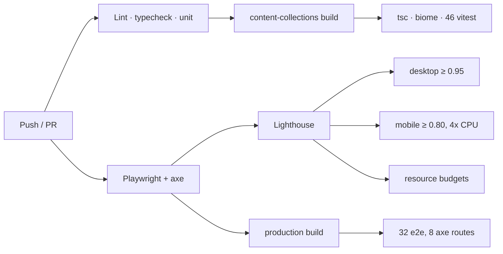

<div align="center">

# 🌐 Juan Silva — Portfolio

### Mechatronics Engineer & AI Specialist

*A bilingual portfolio built around generative visuals, scroll-driven motion, and an accessibility budget that fails the build.*

[](https://nextjs.org/)
[](https://react.dev/)
[](https://www.typescriptlang.org/)
[](https://tailwindcss.com/)
[](https://biomejs.dev/)
[](https://portfolio-juan-silva-eight.vercel.app)
[](LICENSE)

**[Live Site](https://portfolio-juan-silva-eight.vercel.app) · [Architecture](#-architecture) · [Visual layer](#-the-visual-layer) · [Motion](#-motion) · [Getting Started](#-getting-started)**

</div>

---

## 📖 Overview

A ground-up rebuild of my portfolio. The previous version was Next.js 13, plain
JavaScript and Tailwind 3, written in 2023 and left untouched through a career
move from IT consulting to AI engineering.

The current version is built around one idea — **systems and signal** — drawn from
the actual work: mechatronics on one side, AI and automation on the other. Every
generative element on the page is a point system in motion, because that is what
the work looks like.

---

## 🛠 Stack

<table>
<tr><td>

**Framework**
- Next.js 16 (App Router + RSC)
- React 19
- TypeScript 5, strict

</td><td>

**Styling & motion**
- Tailwind CSS 4 (CSS-first)
- CSS scroll-driven animation
- Canvas 2D · next-themes

</td><td>

**Content & i18n**
- Content Collections + MDX
- Zod-validated frontmatter
- next-intl v4 (`/es`, `/en`)

</td></tr>
<tr><td>

**Testing**
- Vitest + Testing Library
- Playwright + axe-core
- Lighthouse CI, desktop + mobile

</td><td>

**Tooling**
- Biome
- pnpm 10
- GitHub Actions

</td><td>

**Deploy**
- Vercel
- Analytics + Speed Insights

</td></tr>
</table>

**Type:** Poppins for display and body, JetBrains Mono for labels and code.

---

## 🎨 The visual layer

Four generative systems, all Canvas 2D. No WebGL and no animation library — these
are two-dimensional point systems, so `three.js` would cost ~150 KB to draw
something flat.

| Where | What |
|---|---|
| **Hero** | **Flow field.** Particles advected through value noise, leaving trails. The cursor is a *vortex*, not an attractor — an attractor collapses the whole field into a dot within seconds. |
| **About, stats, work, contact** | **Displaced lattice.** A point grid pushed out of alignment by travelling noise. The cursor acts as a lens, points parting around it with a smootherstep falloff so there is no visible seam at the influence radius. |
| **What I do** | **Signal graph.** Skill categories as hubs, technologies as nodes, pulses travelling the edges. |
| **Track record** | **Charging rail.** A timeline that fills as it scrolls, nodes lighting in sequence. Pure CSS. |

The field adapts to the surface it sits on rather than being pasted identically
across the page — full strength on the statement and the work, softer on the
stats band, and inverted on the contact band. Section rhythm is what makes the
page readable as distinct sections; running one field at one strength everywhere
would flatten it.

Cost of all of it: **TBT 20 ms, CLS 0.** Every loop runs after hydration and is
`IntersectionObserver`-gated, so only the visible field runs.

---

## 🌀 Motion

**CSS scroll-driven animation is the primary layer.** `animation-timeline: view()`
costs 0 KB, runs on the compositor, and — unlike anything gated behind a cursor —
works on touch. That last point is the whole reason it exists: an earlier version
bound every effect to the mouse, so on a phone the page was a static document.

Motion's `whileInView` was rejected on architecture, not weight: it requires
`'use client'` on every animated component, which here would push next-intl's
server API across the client boundary for the sake of a fade. `Reveal` is a server
component.

JS motion appears only where CSS cannot reach — interpolating text content in the
stat counters, and drawing pixels in the fields.

`prefers-reduced-motion` is handled explicitly rather than inherited. The usual
global `animation-duration: 0.01ms` override does nothing to a progress-based
timeline, because those are driven by scroll position rather than elapsed time —
without an explicit rule every revealed element stays at `opacity: 0` and the page
is blank for those users. Five tests hold that shut.

---

## 🏗 Architecture

Feature-sliced. Each domain owns its directory; dependencies run one way.

```
content/
├── projects/*.mdx          13 projects, es + en pairs
├── posts/*.mdx             2 posts
└── talks/*.mdx             2 talks
src/
├── app/[locale]/           routes: home, projects, blog, talks (+ detail pages)
├── features/
│   ├── hero/ about/ projects/ case-study/ blog/ talks/ contact/
│   └── cursor/             blob, spotlight, distort, proximity reveal
├── shared/
│   ├── ui/                 primitives, Reveal, Eyebrow, FieldCanvas
│   ├── lib/                cn, formatDate, noise
│   ├── i18n/ mdx/ content/ config/
└── messages/{es,en}.json   all copy, both locales
```

### Conventions worth knowing

| | |
|---|---|
| **Copy** | Lives in `src/messages/*.json`, never in components. Key sets must match across locales or next-intl throws at runtime. |
| **Content filenames** | `<slug>.{es,en}.mdx`. Anything else throws at build time, by design. |
| **Middleware** | `proxy.ts` at the root — Next 16 renamed it. |
| **Colour** | Role-named Tailwind utilities (`text-body`, `border-border`, `bg-surface`) generated from `@theme inline`. No arbitrary `var()` syntax anywhere. |
| **Server first** | 19 client components out of the whole tree; every page section is RSC. |

`CLAUDE.md` documents the rest — including the traps that have already cost time.

---

## ⚡ CI

Runs on push to `main` and `refactor/**`, and on PRs to `main`.


```mermaid
graph LR
    A[Push / PR] --> B[Lint · typecheck · unit]
    A --> C[Playwright + axe]
    C --> D[Lighthouse]
    B --> B1[content-collections build]
    B1 --> B2[tsc · biome · 46 vitest]
    C --> C1[production build]
    C1 --> C2[32 e2e, 8 axe routes]
    D --> D1[desktop ≥ 0.95]
    D --> D2[mobile ≥ 0.80, 4x CPU]
    D --> D3[resource budgets]
```

**Accessibility is a build gate, not a claim.** axe runs against eight routes
including every detail template, and fails on `moderate` and above — narrowing it
to serious+critical previously let two real WCAG failures ship.

Measured on a production build:

| | performance | accessibility | best practices | SEO |
|---|---|---|---|---|
| Desktop | **100** | **100** | 96 | **100** |
| Mobile · 4× CPU, ~1.6 Mbps | **88** | **100** | 96 | **100** |

*(best practices is 96 locally only — two `/_vercel/*` scripts that exist only when deployed.)*

Budgets cap script, font, image and total transfer. A category score is far too
coarse to catch "someone re-added a 4 MB portrait", which is a thing that actually
happened here.

---

## 🚀 Getting Started

```bash
pnpm install
pnpm dev            # http://localhost:3000 → /es
```

| Command | |
|---|---|
| `pnpm dev` | Dev server |
| `pnpm build` / `pnpm start` | Production build and serve |
| `pnpm typecheck` | `tsc --noEmit` |
| `pnpm check` / `check:fix` | Biome |
| `pnpm test` | Vitest — 46 tests |
| `pnpm e2e` | Playwright — 32 tests. **Use `--workers=1` locally.** |
| `pnpm lhci` | Lighthouse, desktop |

> `pnpm exec content-collections build` must run before `typecheck` — it generates
> the content types. CI does this explicitly.

---

## 📁 Content

**13 projects · 2 posts · 2 talks**, each authored as an `.es.mdx` + `.en.mdx`
pair with Zod-validated frontmatter. Case studies follow problem → solution →
stack decisions → impact.

---

## 📄 License

Personal portfolio. All content, images, and design are © Juan Silva.
Unauthorized copying or distribution is not permitted.

---

<div align="center">

**[portfolio-juan-silva-eight.vercel.app](https://portfolio-juan-silva-eight.vercel.app)**

</div>
